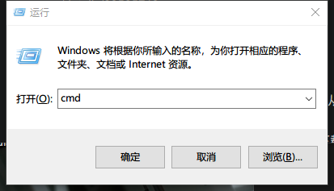
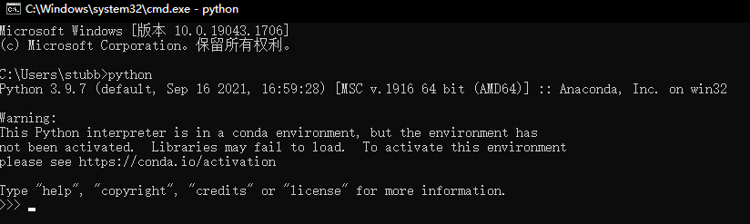
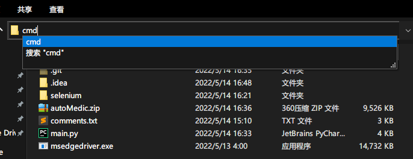

# 小笨蛋也用得来的自动医疗兵程序

## 0x-1

首先需要确认你电脑上安装了python，确认已安装的请跳转至 0x0，如果不知道自己电脑上有没有安装python的，可以使用快捷键 win+r 调出运行窗口，在窗口内输入「cmd」然后回车。

然后在打开的黑框框内输入 「python」回车确认。如果你的窗口内出现了类似的输出说明你已经安装了python，请跳转至0x0。

## 0x0

下载代码，用过，会用一点python编程的可以直接从 [GitHub](https://github.com/Blacklyy/autoMedic) 获取源代码。

小笨蛋的可以从 GitHub上 [Release](https://github.com/Blacklyy/autoMedic/releases/download/v0.2/autoMedicV0.2.zip) 或者 [百度云](https://pan.baidu.com/s/1xfHP60xEowZs50yNdAF89A?pwd=qaca) 下载。

下载得到压缩包解压后你应该可以得到三个文件 main.py，msedgedriver.exe、comments.txt和文件夹selenium。

三个文件分别是代码文件、依赖程序和评论文件。如果没有能力不建议修改前两个文件，comments.txt可以直接打开修改，评论时会从中随机选择一句用来评论。

## 0x1

为了避免小笨蛋不会安装依赖库，依赖selenium已经一起打包在zip压缩包内，所以代码是开箱即用的。

- 首先我们打开解压后的文件夹，

- 在文件夹目录位置输入 「 cmd 」， 然后回车确认。
- 你应该可以看到一个黑框框出现在你面前。
- 然后我们在黑框框内输入 「 python main.py 」。稍微等十几秒。
- 代码自动打开edge浏览器然后进入微博的首页，在该页面登录你的微博帐号。
- 在黑框框内输入回车。
- 大功告成，现在你可以离开电脑让程序自动帮你奶人啦！

## 0x2

关于自定义

- 自定义发送文案，可以修改 「comment.txt」文件，一个文案一行，不要太长，会发不出，暂时没有文案长度的判断。
- 自定义文案前缀或者后缀， 使用 txt 或其它文本编辑器打开 main.py，修改代码的第18行。代码内目前将 "提醒求奶不要加超话的tag "作为前缀，你可以自行修改。同样要注意不要超出长度限制。

